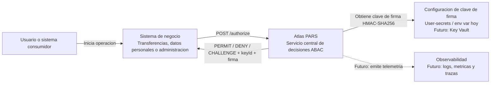
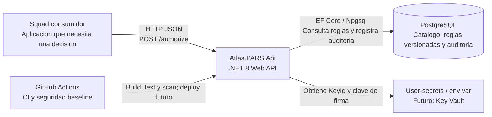
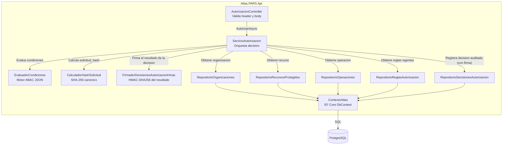
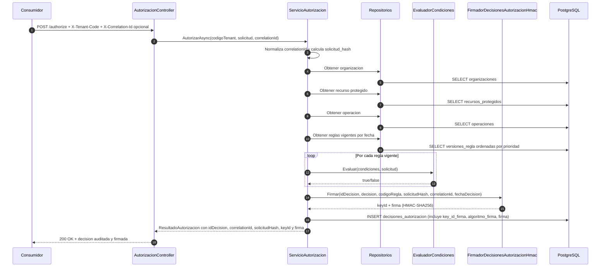
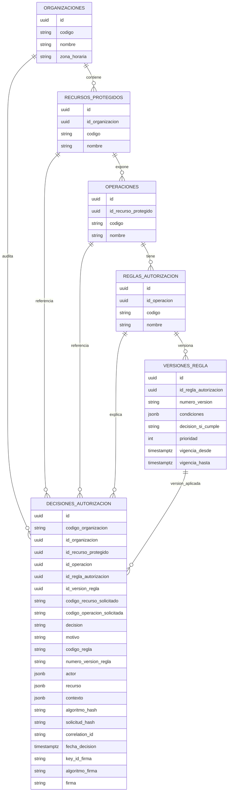

# Arquitectura

## Objetivo

Atlas PARS centraliza decisiones de autorizacion para operaciones sensibles. El PoC actual implementa el nucleo ABAC: recibe una solicitud, resuelve tenant/recurso/operacion, evalua reglas declarativas versionadas y devuelve `PERMIT`, `DENY` o `CHALLENGE`.

## Alcance Actual

Incluido:

- API .NET 8.
- Endpoint `POST /authorize`.
- PostgreSQL.
- Versionado temporal de reglas.
- Evaluador JSON para condiciones ABAC.
- Reglas de ejemplo para transferencias financieras del tenant Finora.
- Auditoria persistente de decisiones en tabla append-only.
- `solicitud_hash` SHA-256 sobre solicitud canonica.
- Firma HMAC-SHA256 del resultado de cada decision, con clave inyectada por configuracion.
- `X-Correlation-Id` para rastrear decisiones entre consumidor, API y base.
- IaC de referencia para Azure Container Apps, PostgreSQL Flexible Server, Key Vault, ACR y Log Analytics.

Fuera del alcance implementado:

- Despliegue cloud real.
- Observabilidad productiva.
- Despliegue cloud automatizado completo con OIDC, build/push de imagen y migraciones.
- Multiples claves de firma verificables (rotacion sin perder auditoria retroactiva).

## C4 Nivel 1 - Contexto



## C4 Nivel 2 - Contenedores



## C4 Nivel 3 - Componentes API



## Flujo De Autorizacion



## Modelo De Datos



## Reglas Versionadas

Cada regla puede tener varias versiones, pero la migracion inicial agrega una restriccion de no solapamiento temporal por regla usando `btree_gist` y `EXCLUDE USING gist`. Esto evita que dos versiones de la misma regla esten vigentes al mismo tiempo.

La seleccion de reglas usa:

- `id_operacion`
- `vigencia_desde <= fechaEvaluacion`
- `vigencia_hasta IS NULL OR vigencia_hasta > fechaEvaluacion`
- orden ascendente por `prioridad`

## Decisiones De Diseno

- El motor usa JSON propio para mantener el MVP explicable y testeable.
- El sistema falla cerrado: si no hay regla vigente o ninguna regla aplica, responde `DENY`.
- Los errores tempranos de tenant, recurso u operacion no configurada tambien responden `DENY` auditado.
- La prioridad de reglas permite que controles de seguridad, como aislamiento de tenant y riesgo critico, ganen sobre permisos normales.
- PostgreSQL guarda las reglas como `jsonb` y mantiene integridad relacional del catalogo.
- Cada decision controlada se persiste en `decisiones_autorizacion`.
- La tabla de auditoria es append-only: un trigger bloquea `UPDATE` y `DELETE`.
- `solicitud_hash` usa SHA-256 sobre una representacion canonica de tenant, recurso, operacion, actor, recurso y contexto.
- `correlation_id` viene de `X-Correlation-Id` o se genera internamente si el consumidor no lo envia.
- El resultado de la decision (no la solicitud cruda) se firma con HMAC-SHA256 sobre un payload canonico que incluye `idDecision`, `codigoOrganizacion`, `decision`, `codigoRegla`, `solicitudHash`, `correlationId` y `fechaDecision`.
- El firmador falla cerrado al intentar firmar una decision si la clave no esta configurada o no es Base64 valido.
- Se eligio una unica clave activa (sin arreglo de claves para rotacion) por simplicidad de PoC; ver ADR 0004 para la limitacion aceptada.

## Trazabilidad De Decisiones

La respuesta de `POST /authorize` incluye:

```json
{
  "idDecision": "uuid",
  "decision": "PERMIT",
  "motivo": "Aplico la regla 'PERMITIR_TRANSFERENCIA_NORMAL'.",
  "codigoRegla": "PERMITIR_TRANSFERENCIA_NORMAL",
  "correlationId": "corr-123",
  "solicitudHash": "hex-sha256",
  "keyId": "atlas-pars-hmac-2026-07",
  "firma": "base64-hmac-sha256"
}
```

El registro persistente guarda la solicitud evaluada en tres documentos `jsonb`: `actor`, `recurso` y `contexto`. Tambien guarda la regla y version aplicada cuando existen. Si la decision ocurre antes de resolver todo el catalogo, por ejemplo tenant inexistente, recurso inexistente u operacion inexistente, las FKs no resueltas quedan `NULL`, pero los codigos solicitados y el resultado `DENY` quedan auditados.

La auditoria ahora prueba integridad operacional y criptografica. `key_id_firma`, `algoritmo_firma` y `firma` permiten reconstruir que evaluo Atlas, por que regla respondio, y verificar mediante HMAC-SHA256 que la decision no fue alterada despues de emitida (recalculando la firma con la misma clave y comparando en tiempo constante). Las tres columnas son nullable en conjunto: las decisiones auditadas antes de este incremento no tienen firma retroactiva.

## Riesgos Arquitectonicos

- El evaluador actual soporta `todas` como AND, pero no soporta OR, negaciones compuestas ni reglas anidadas.
- La API no tiene todavia middleware de errores global para fallas inesperadas.
- La cadena de conexion y la clave de firma deben gestionarse con user-secrets o variables de entorno; no deben commitearse valores reales.
- Una unica clave de firma activa: rotarla invalida la verificacion de decisiones historicas firmadas con la clave anterior.
- No se ha probado P95 < 150 ms bajo carga.

## Evolucion Propuesta

1. Migrar a multiples claves de firma verificables para permitir rotacion sin perder auditoria retroactiva.
2. Agregar endpoint o herramienta interna para verificar firma y hash sin tener que instanciar el servicio manualmente.
3. Ampliar pruebas automatizadas end-to-end para el Caso C (contexto sospechoso) y Caso D (riesgo critico) del catalogo ABAC MVP; `CHALLENGE` (monto sensible) y `DENY` por aislamiento de tenant ya estan cubiertos.
4. Incorporar health checks, logs estructurados y OpenTelemetry.
5. Aplicar IaC en una suscripcion real, validar costos y documentar outputs.
6. Extender CI/CD con despliegue cloud, ambientes y aprobaciones.
